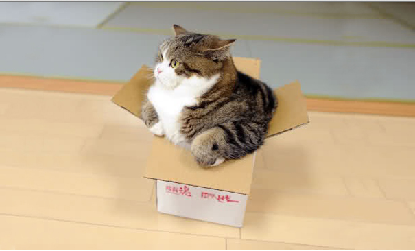

## Version Control System
  + Have different versions of our files
  + The Logo For GIthub is a really cool Octocat
  + Collaborative
  + Interact with it blahbalhconflictusing a command line app
  + share pictures of Cats

+ Encourages Being Specific About What You're Doing

What's Hard
+ A lot of steps
 + Syntax can be hard
+ Keeping track of what's local vs what's remote
+ How to undo a mistake
+ Different ways to do the same thing
+ this is one of my favorite pictures of Maru. 
